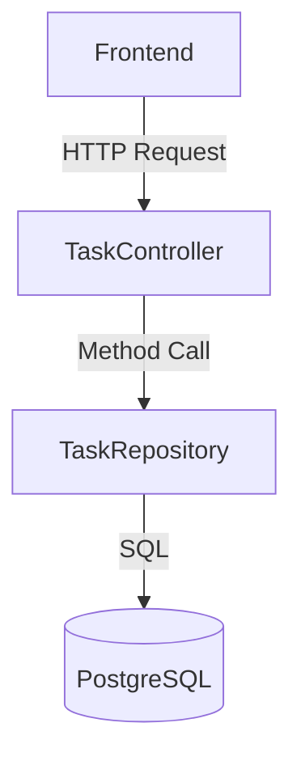

# Task Manager - Backend 🛡️

[](https://github.com/anuraghazra/github-readme-stats)

## 1. Overview & Architecture
This is a **RESTful API** built with **Spring Boot 3** and **Java 17**. It serves as the core logic layer for the Task Management System, handling data persistence, validation, and business rules.

### Why this stack?
-   **Spring Boot**: Provides a robust, production-ready framework with minimal configuration.
-   **JPA/Hibernate**: simplify database interactions using Object-Relational Mapping (ORM), eliminating boilerplate SQL.
-   **Layered Architecture**: Separation of concerns (Controller handles HTTP, Repository handles DB).



---

## 2. Key Components

### `TaskController.java`
The entry point for API requests. It defines the endpoints and handles HTTP status codes.
-   **CORS**: Configured to allow requests from any origin (`*`) to facilitate easy deployment on Vercel/Render.

### `TaskRepository.java`
Interface extending `JpaRepository`.
-   Provides standard CRUD methods (`save`, `findById`, `delete`).
-   Include custom finders: `findByCategory` and `findByStatus`.

### `Task.java` (Entity)
The data model mapping to the `task` table.

---

## 3. Database Schema
One single table named **`task`**.

| Column | Type | Notes |
| :--- | :--- | :--- |
| `id` | BigInt | Auto-increment Primary Key |
| `title` | Varchar | Required |
| `category` | Enum | WORK, HOME, PERSONAL |
| `priority` | Int | 1 (High) - 5 (Low) |
| `status` | Enum | TODO, IN_PROGRESS, DONE |
| `created_at` | Timestamp | Auto-set on creation |

---

## 4. API Usage Guide

### Base URL
Local: `http://localhost:8081/api/tasks`
Production: `https://your-app.onrender.com/api/tasks`

### Examples (cURL)

#### 1. Get All Tasks
```bash
curl -X GET http://localhost:8081/api/tasks
```

#### 2. Create a Task
```bash
curl -X POST http://localhost:8081/api/tasks \
  -H "Content-Type: application/json" \
  -d '{
    "title": "Fix server bug",
    "category": "WORK",
    "priority": 1
}'
```

#### 3. Update Status (Move Card)
```bash
curl -X PATCH http://localhost:8081/api/tasks/1/status \
  -H "Content-Type: application/json" \
  -d '{ "status": "Doing" }'
```

---

## 5. Setup & Run

### Prerequisites
-   Java 17+ (JDK)
-   Maven
-   PostgreSQL Database running on port 5432 (DB name: `tasks_db`)

### Steps
1.  **Configure DB**: Update `src/main/resources/application.properties` with your Postgres credentials.
2.  **Run**:
    ```bash
    mvn spring-boot:run
    ```
The server will start on port **8081**.
